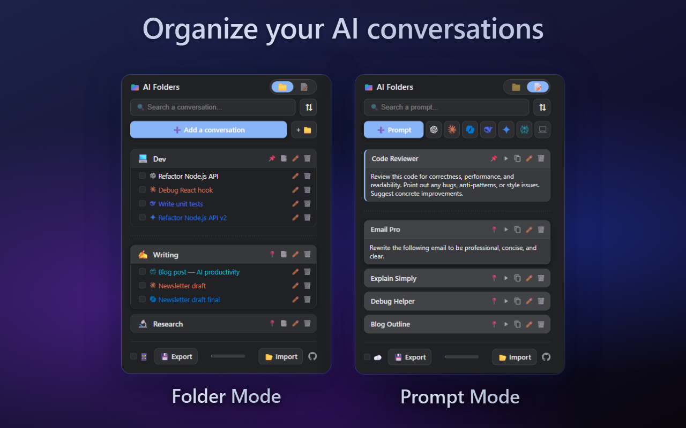

# 📁 Gemini Folders & AI Folders — Browser Extensions



A family of lightweight, multilingual browser extensions to **organize your AI conversations into folders** and **build a personal prompt library**. Stop losing your best ideas in an endless chat history — build a structured workspace accessible from any device.

---

## 🤖 AI Folders *(New)*

**AI Folders** is the multi-platform evolution: it works across **ChatGPT, Claude, Perplexity, Copilot, Gemini**, and local LLMs — all from a single extension. Save any AI conversation with a right-click or keyboard shortcut, inject saved prompts directly into any supported AI, and keep everything organized across your devices.

[](https://chromewebstore.google.com/detail/ai-folders/kjmgfajofolnfeaahchpmkpecfimcppf)
[](https://addons.mozilla.org/firefox/addon/ai_folders/)

### Supported platforms
| Platform | Folders | Quick Save | Prompt Injection |
|---|---|---|---|
| ChatGPT | ✅ | ✅ | ✅ |
| Claude | ✅ | ✅ | ✅ |
| Perplexity | ✅ | ✅ | ✅ |
| Microsoft Copilot | ✅ | ✅ | ✅ |
| Google Gemini | ✅ | ✅ | ✅ |
| Local LLM *(configurable URL)* | ✅ | ✅ | ✅ *(Open WebUI & others)* |

---

## 📁 Gemini Folders *(Original)*

**Gemini Folders** is the original extension, purpose-built for **Google Gemini**. Lighter footprint, same core experience.

[](https://chromewebstore.google.com/detail/gemini-folders/jffchdehoapigpmifkmleglfimjiilik)
[](https://addons.mozilla.org/firefox/addon/gemini_folders/)

---

## ✨ Features (both extensions)

### 📁 Folder Manager

* 📱 **Mobile Sync (Bookmarks Bridge):** Access your conversations on the go! Toggle mobile sync to create a smart, one-way synced folder in your browser bookmarks, mirroring your layout and **custom sort order** on your phone.
* ⌨️ **Panel Shortcut:** Open the extension panel instantly from any tab with `Ctrl+Shift+1` on PC / `Cmd+Shift+1` on Mac (both Chrome and Firefox).
* ⚡ **Quick Save (Context Menu & Shortcuts):** Save the current conversation to any folder via right-click, or use the global keyboard shortcut (`Ctrl+Shift+S` on Chrome, `Alt+Shift+S` on Firefox) to send it instantly to a “⚡ Quick Saves” folder. Visual toast alerts confirm saves and flag duplicates.
* 🛡️ **Bulletproof Database & Smart Deduplication:** Secure fallback architecture guards against corruption. Smart URL normalization prevents false duplicates even when AI platforms change their URL parameters.
* ☑️ **Bulk Actions (Multi-Select):** Select multiple conversations at once via checkboxes to move or delete them in batches.
* 📑 **Tab Groups Integration:** Open an entire folder in one click — conversations open in native, color-coded browser Tab Groups (where supported).
* 😃 **Custom Folder Emojis:** Start a folder name with an emoji (e.g., “💻 Code”) and it becomes the folder icon automatically.
* ⇅ **Custom Sorting:** Sort folders and conversations by Newest, Oldest, or A-Z on the fly, with changes reflected instantly in mobile sync.
* 🖱️ **Drag & Drop:** Move conversations between folders intuitively.
* 🗜️ **Ultra-Efficient Compression:** LZString compression maximizes browser sync storage so you can save hundreds of conversations securely.
* 📊 **Storage Tracker:** A visual progress bar shows available cloud storage in real-time with detailed tooltips.
* 🎨 **Modern Material UI:** Custom Material 3 modal dialogs, ultra-compact footer, collapsible Add panel, and clean hover effects.
* 📌 **Pin Favorites:** Pin important folders to the top for instant access.
* 🤖 **Smart Title Detection:** Automatically reads the AI interface to extract the exact conversation title in the background.
* 🔍 **Instant Search:** Real-time search bar across all saved conversations.
* ☁️ **Cloud Sync:** `storage.sync` keeps everything synchronized across all devices on your browser profile.
* 💾 **Import / Export:** Backup and restore your folder structure (including pins) via JSON.
* 🌍 **Multilingual & Adaptive:** Supports **43 languages** and automatically matches your system’s Dark/Light mode.
* 🤝 **Open Source & Modular:** Clean, modular architecture (separated UI, data logic, styling) for easy community contributions.

### 📝 Prompt Manager

* 📝 **Prompt Library:** Switch to Prompt Mode via the pill toggle. Save reusable prompts with a title and full text, find them instantly with search and sort.
* ▶ **One-Click Injection:** Hit the play button on any saved prompt to inject it directly into the active AI tab’s input field — works across all supported platforms in AI Folders.
* ⌨️ **Prompt Trigger with Live Suggestions:** Type `#` in any AI chat field to instantly see all your saved prompts, filtered in real time as you type. The extension name appears as a label above the suggestions. Press **Space** on a unique match to autocomplete, or on an exact match to inject. Matching is case-insensitive and strips leading emojis. *(AI Folders: all supported sites including local LLMs; Gemini Folders: Gemini only.)*
* ✏️ **Inline Editing:** Click a prompt to expand and edit it directly. Changes auto-save after a short pause.
* 💎 **Custom Gem / AI Link:** Configure a custom URL (Gemini Gem or any AI) and toggle it with the 💎 button to make the “New Conversation” button open it. *(Gemini Folders only — AI Folders uses per-service shortcut buttons.)*
* 📌 **Pin Important Prompts:** Pinned prompts stay at the top above a visual divider, independent of sort order.
* ☁️ **Prompt Sync:** Enable cloud sync for your prompt library independently from folders.

---

## 🚀 Installation

### Option 1: Official Stores (Recommended)

**AI Folders:**
👉 **[Install for Google Chrome](https://chromewebstore.google.com/detail/ai-folders/TODO)**
👉 **[Install for Mozilla Firefox](https://addons.mozilla.org/firefox/addon/ai_folders/)**

**Gemini Folders:**
👉 **[Install for Google Chrome](https://chromewebstore.google.com/detail/gemini-folders/jffchdehoapigpmifkmleglfimjiilik)**
👉 **[Install for Mozilla Firefox](https://addons.mozilla.org/firefox/addon/gemini_folders/)**

### Option 2: Developer Mode (Manual Installation)

This project uses a Python build pipeline to generate browser-specific versions.

**Prerequisites:** [Python 3](https://www.python.org/) and [Node.js](https://nodejs.org/).

1. Clone or download this repository.
2. Run the build script:
   ```bash
   python build.py
   ```
   npm dependencies are installed automatically on first run. The test suite runs before every build.
3. **For Chrome:** Go to `chrome://extensions/`, enable **Developer mode**, click **Load unpacked** and select:
   - AI Folders → `dist/ai-folders/chrome/`
   - Gemini Folders → `dist/gemini-folders/chrome/`
4. **For Firefox:** Go to `about:debugging` → **This Firefox** → **Load Temporary Add-on...** and select the `manifest.json` inside:
   - AI Folders → `dist/ai-folders/firefox/`
   - Gemini Folders → `dist/gemini-folders/firefox/`

---

## 🛠️ Usage

### Folder Mode
1. Open a conversation on any supported AI platform.
2. **Quick save:** `Ctrl+Shift+S` (Chrome) / `Alt+Shift+S` (Firefox) to save to Quick Saves, or right-click → hover over the save menu.
3. **Via the extension:** Click the toolbar icon or press `Ctrl+Shift+1` (`Cmd+Shift+1` on Mac) to open the panel. The title is auto-detected. Expand the add panel (➕), select or create a folder, and hit **Save**.
4. **Mobile sync:** Click `📱` in the footer to mirror your folders in browser bookmarks.
5. Drag & drop items, use checkboxes for bulk actions, open folders as Tab Groups, or pin favorites with 📌.

### Prompt Mode
1. Click the **📝** side of the pill toggle to switch to Prompt Mode.
2. **Save a prompt:** Click **➕ Add Prompt**, enter a title and text, hit **Save**.
3. **Quick inject via trigger:** Type `#` to instantly see all your saved prompts, or keep typing to filter in real time. Press **Space** on a unique match to autocomplete (suggestion panel stays stable), or on an exact match to inject. *(Perplexity: suggestions disabled — type the exact prompt name and press Space.)*
4. **Use a prompt via panel:** Click any saved prompt to expand it, then hit **▶** to inject it into the active AI tab.
5. **New conversation:** *(AI Folders)* Use the per-service shortcut buttons in Prompt Mode. *(Gemini Folders)* Click 💎 to configure a custom Gem URL, then 💬 to open a new conversation.
6. Pin prompts with 📍, search and sort freely — all changes sync automatically.

---

## 🔒 Privacy & Security

Both extensions are built with privacy in mind.

* **Gemini Folders** only requests access to `gemini.google.com` and the context menu.
* **AI Folders** requests access to the supported AI domains (`chatgpt.com`, `claude.ai`, `perplexity.ai`, `copilot.microsoft.com`, `gemini.google.com`) and the context menu — and nothing else.
* The `bookmarks` permission is used strictly to manage the mobile sync folder when you enable that feature.
* Tab content is read **only** when you explicitly save a conversation, solely to extract its title.
* All data is stored in your browser’s built-in sync storage. **No third-party servers, no analytics, no tracking.** Your data is entirely yours.

---

## 💻 Built With

* HTML5 / CSS3
* Vanilla JavaScript (Modular Architecture: UI, Logic, Bulk Actions, Site Config)
* WebExtensions API (Manifest V3)
* Service Workers / Event Pages (Background Scripts)
* LZ-String (Data Compression)
* Python (Cross-browser Build Automation)
