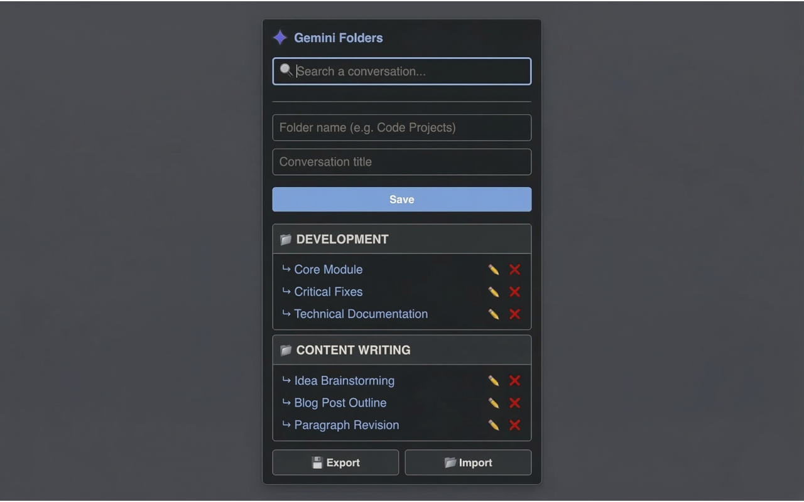

# 📁 Gemini Folders - Chrome Extension

**Gemini Folders** is a lightweight, multilingual Chrome extension that allows you to organize your Google Gemini conversations into custom folders. Stop losing your best prompts in an endless history and build a structured workspace!

## ✨ Features

* ⚡ **Quick Save (Context Menu & Shortcuts):** Save the current conversation directly to any folder using the right-click menu, or use the global keyboard shortcut (`Ctrl+Shift+S` or `Cmd+Shift+S` on Mac) to instantly send it to a "⚡ Quick Saves" folder!
* ☑️ **Bulk Actions (Multi-Select):** Select multiple conversations at once using checkboxes to move or delete them in batches, saving you tons of clicks.
* 📑 **Tab Groups Integration:** Open an entire folder of conversations with a single click. They will automatically open in a native, color-coded Chrome Tab Group for ultimate project management.
* 😃 **Custom Folder Emojis:** Start your folder name with an emoji (e.g., "💻 Code" or "🌍 Travel") and the extension will automatically use it as the folder's icon instead of the default one.
* ⇅ **Custom Sorting:** Sort your saved conversations on the fly by Newest, Oldest, or Alphabetically (A-Z) using the dedicated dropdown menu.
* 🖱️ **Drag & Drop:** Easily move saved conversations between folders to reorganize your workspace intuitively.
* 🗜️ **Ultra-Efficient Compression:** Automatically compresses your synced data using LZString, maximizing Chrome's native storage capacity so you can save hundreds of conversations securely.
* 📊 **Storage Tracker:** A sleek visual progress bar keeps you informed of your available cloud storage capacity in real-time, complete with detailed tooltips.
* 🎨 **Modern Material UI:** Enjoy a sleek, ultra-compact, and responsive design with a collapsible "Add" panel, clean hover effects, and pixel-perfect icons.
* 📁 **Smart Folders:** Group your chats by projects, themes, or categories. Create empty folders in advance and manage them easily.
* 📌 **Pin Favorites:** Pin your most important folders to the top of the list for ultra-fast access.
* 🤖 **Smart Title Detection:** No more typing! The extension automatically reads the Gemini interface to extract the exact name of your current conversation in the background.
* 🔍 **Instant Search:** Find any conversation quickly with a real-time search bar.
* ☁️ **Cloud Sync:** Uses native `chrome.storage.sync` to keep your folders synchronized across all devices connected to your Google account.
* 💾 **Import / Export:** Easily backup and restore your folder structure (including pinned folders) via JSON files.
* 🌍 **Multilingual & Adaptive:** Automatically detects your browser language (supports English, French, Spanish, Brazilian Portuguese, German, and Japanese) and matches your system's Dark/Light mode.

## 🚀 Installation

### Option 1: Chrome Web Store (Recommended)
You can install the official, auto-updating version directly from the Chrome Web Store:
👉 **[Install Gemini Folders](https://chromewebstore.google.com/detail/gemini-folders/jffchdehoapigpmifkmleglfimjiilik)**

### Option 2: Developer Mode (Manual Installation)
If you want to test the code locally or contribute to the project:
1. Clone or download this repository.
2. Open Google Chrome and navigate to `chrome://extensions/`.
3. Enable **Developer mode** in the top right corner.
4. Click on **Load unpacked** and select the extension directory.

## 🛠️ Usage

1. Open a conversation on [gemini.google.com](https://gemini.google.com).
2. **To save instantly:** Press `Ctrl+Shift+S` (`Cmd+Shift+S` on Mac) to save to Quick Saves, or right-click anywhere on the page and hover over "Save to Gemini Folders".
3. **To save via the Extension:** Click the **Gemini Folders** icon in your toolbar. The title is automatically detected. Expand the add panel (➕), select or create a folder, and hit **Save**.
4. Drag and drop items, use checkboxes for bulk actions, open folders as Tab Groups (📑), or use the 📌 icon to pin your favorites!

## 🔒 Privacy & Security

This extension is built with privacy in mind. 
* It **only** requests access to the `gemini.google.com` domain and the context menu.
* It dynamically reads the active tab's content **only** when you explicitly save a conversation to generate a title.
* All data is stored using Chrome's built-in sync storage. **No third-party servers** are used, and your data remains entirely yours.

## 💻 Built With

* HTML5 / CSS3
* Vanilla JavaScript
* Chrome Extension API (Manifest V3)
* Service Workers (Background Scripts)
* LZ-String (Data Compression)